# Gazebo maps
Self-made Gazebo maps for public

#### If you use this repo for your paper, please cite the corresponding papers in the list below

<br>

## List
+ Exploration map used in the paper:
  + [REAL: Rapid Exploration with Active Loop-Closing toward Large-Scale 3D Mapping using UAVs](https://ieeexplore.ieee.org/abstract/document/9636611), *2021 IROS*
    + small-scale maze environment
    + large-scale mine environment - edited from [MBPlanner](https://github.com/ntnu-arl/mbplanner_ros/tree/master/planner_gazebo_sim/worlds)
      + [Video](https://youtu.be/Ux6ir2_ayoY)
  + [QR-SCAN: Traversable Region Scan for Quadruped Robot Exploration using Lightweight Precomputed Trajectory](https://ieeexplore.ieee.org/abstract/document/9650025), *2021 ICCAS*
    + maze with height map (hills and cliff) environment
    + maze with hole-ground
      + [Video](https://youtu.be/bz7Ig6GnC-s)
  + [Peacock exploration: a lightweight exploration for UAV using control-efficient trajectory](), *2020 RiTA*
    + Maze with 3D obstacles
      + [Video](https://youtu.be/t3ysB8Y_GCU)
+ Map used in the paper:
  + [ROLAND: Robust Landing of UAV on Moving Platform using Object Detection and UWB based Extended Kalman Filter](https://ieeexplore.ieee.org/abstract/document/9649920), *2021 ICCAS*
    + wall bounded world (with obstacles)
      + [Video](https://youtu.be/lgHbKAFs7ao)
+ Textureless and featureless map for visual-inertial odometry used in the paper:
  + [STEP: State Estimator for Legged Robots Using a Preintegrated Foot Velocity Factor](https://ieeexplore.ieee.org/abstract/document/9712415), *2022 IEEE RA-L*
    + Iced outdoor mountain
      + [Video](https://youtu.be/NvkI6I0nX4c)
+ War site scenario map used in the paper:
  + [Development of a 3D Mapping System including Object Position for UAV with a RGB-D camerain an Unknown and GNSS-denied Environment
](https://koasas.kaist.ac.kr/handle/10203/277738), *2020 IEMEK*
    + Military fortress (with soldiers, tanks, jets, and etc)
      + [Video1](https://youtu.be/5t-6g7UWA7o) and [Video2](https://youtu.be/0L2FCupYuH8)
+ Quadruped robot [competition map](https://github.com/engcang/gazebo_map_for_khnp)
  + [video](https://youtu.be/6oXx2bvzU9Y), [competition github](https://github.com/Woojin-Seol/KVRC2021)

<br>

## Pictures

<details><summary>[Click to see pictures]</summary>

+ small-scale maze

  <p align="center">
  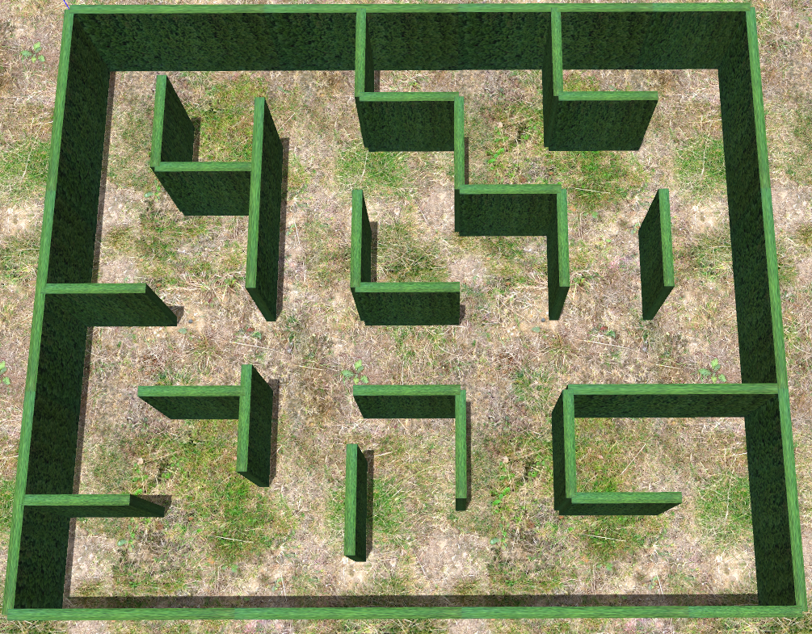
  </p>

+ large-scale mine

  <p align="center">
  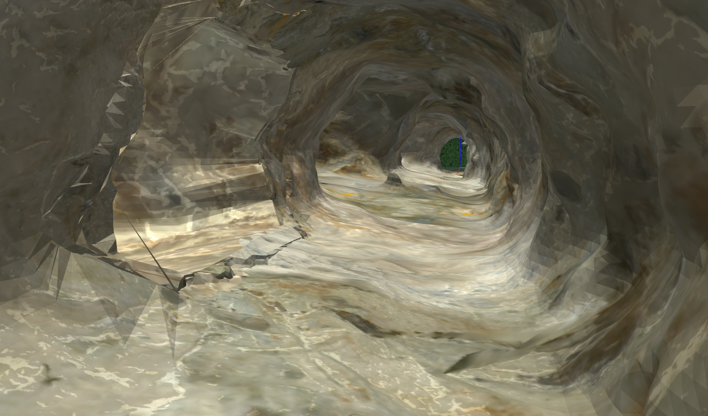
  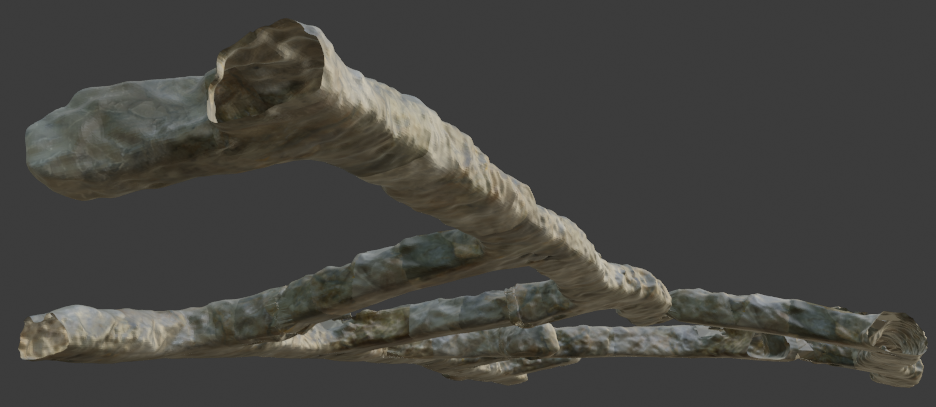
  </p>

+ maze with height maps

  <p align="center">
  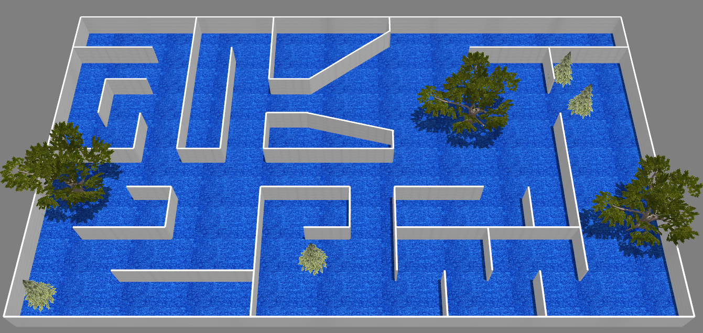
  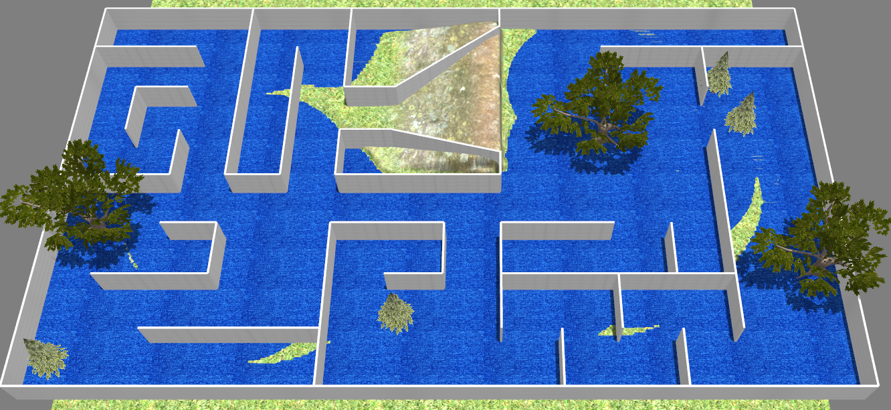
  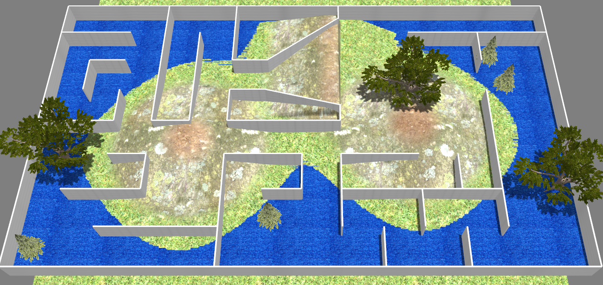
  </p>

+ maze with hole-ground

  <p align="center">
  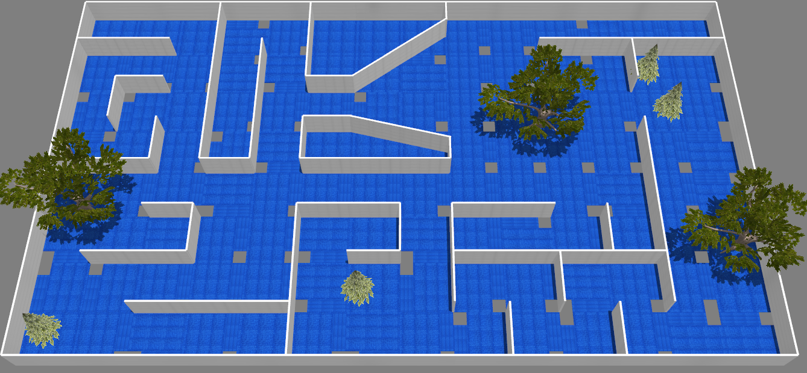
  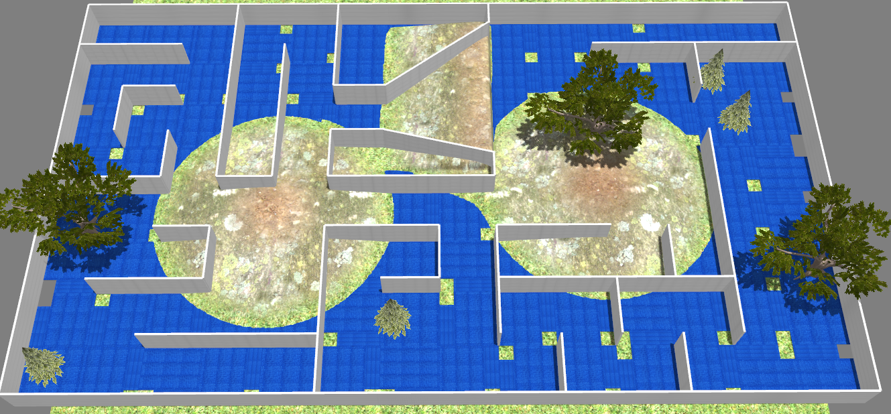
  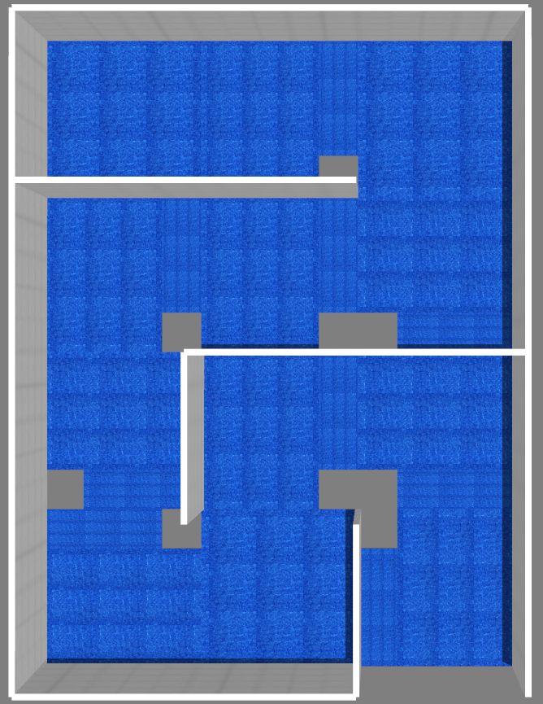
  </p>

+ maze with 3D obstacles

  <p align="center">
  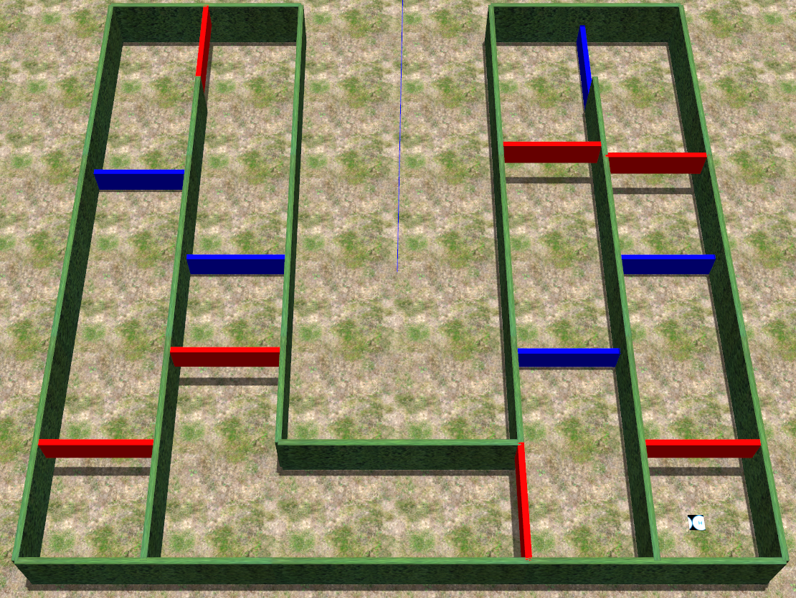
  </p>

+ tall wall-bounded world

  <p align="center">
  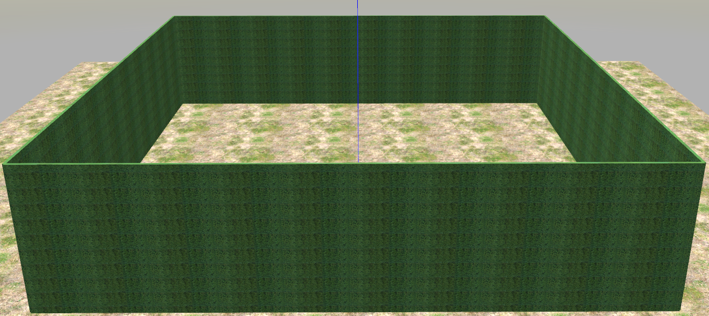
  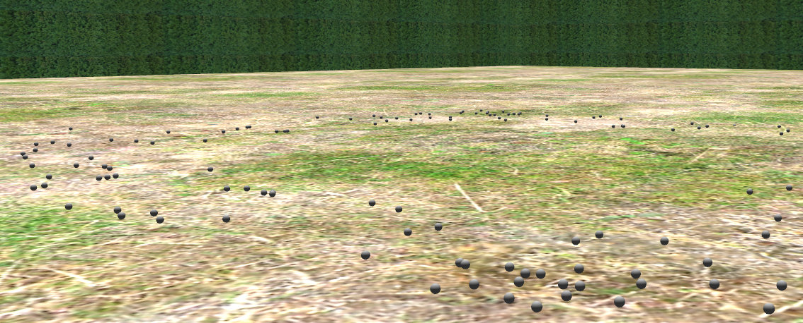
  </p>

+ Iced outdoor mountain
  <p align="center">
  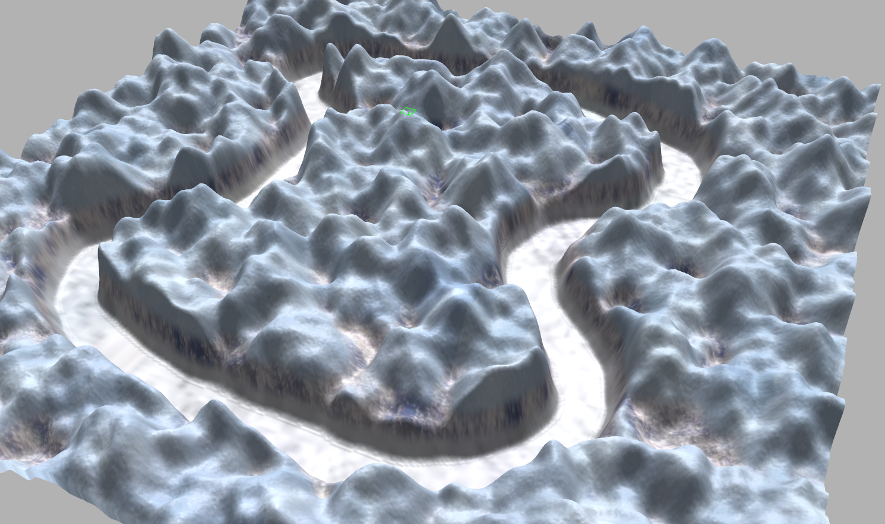
  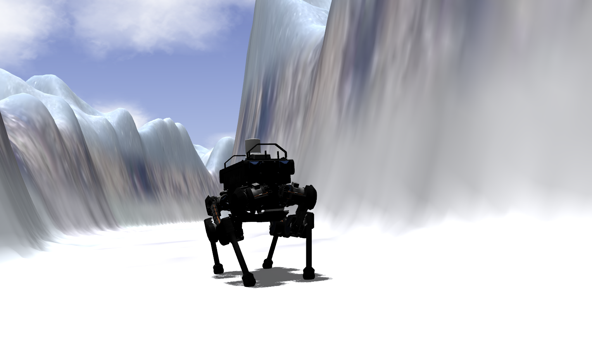
  </p>

+ Military fortress
  <p align="center">
  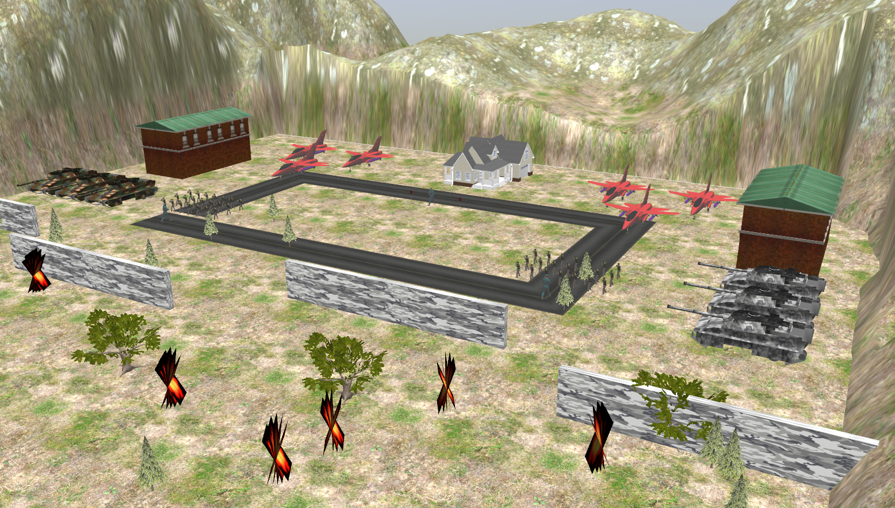
  </p>

</details>

<br><br>

## How to use
### unzip the compressed files
```shell
$ tar -xf name.tar.xz
```
+ Clone the git, add the folder in `GAZEBO_MODEL_PATH`
+ **(Necessary)** Add `common models` to environment first
~~~shell
$ git clone https://github.com/engcang/gazebo_maps
$ echo "export GAZEBO_MODEL_PATH=$GAZEBO_MODEL_PATH:$(pwd)/gazebo_maps/common_models" >> ~/.bashrc
~~~

+ (Optional) add the wanted world to environment
~~~shell
$ echo "export GAZEBO_MODEL_PATH=$GAZEBO_MODEL_PATH:$(pwd)/gazebo_maps/height_maze" >> ~/.bashrc

$ echo "export GAZEBO_MODEL_PATH=$GAZEBO_MODEL_PATH:$(pwd)/gazebo_maps/small_maze" >> ~/.bashrc

$ echo "export GAZEBO_MODEL_PATH=$GAZEBO_MODEL_PATH:$(pwd)/gazebo_maps/3d_maze" >> ~/.bashrc

$ echo "export GAZEBO_MODEL_PATH=$GAZEBO_MODEL_PATH:$(pwd)/gazebo_maps/large_mine_abandoned" >> ~/.bashrc

$ echo "export GAZEBO_MODEL_PATH=$GAZEBO_MODEL_PATH:$(pwd)/gazebo_maps/bounding_wall_world" >> ~/.bashrc

$ echo "export GAZEBO_MODEL_PATH=$GAZEBO_MODEL_PATH:$(pwd)/gazebo_maps/ice_mountains" >> ~/.bashrc

$ echo "export GAZEBO_MODEL_PATH=$GAZEBO_MODEL_PATH:$(pwd)/gazebo_maps/mili_tech" >> ~/.bashrc

$ source ~/.bashrc
~~~

+ launch the `world`
~~~shell
$ roslaunch gazebo_ros empty_world.launch world_name:=$(pwd)/gazebo_maps/height_maze/quad.world
or quad_hill_high.world, quad_hole_ground.world, quad_hole_ground_hill_low.world, etc... 
in same directory

or

$ roslaunch gazebo_ros empty_world.launch world_name:=$(pwd)/gazebo_maps/small_maze/smaze2d.world

or

$ roslaunch gazebo_ros empty_world.launch world_name:=$(pwd)/gazebo_maps/3d_maze/eazy_maze.world

or

$ roslaunch gazebo_ros empty_world.launch world_name:=$(pwd)/gazebo_maps/large_mine_abandoned/lcmine.world

or

$ roslaunch gazebo_ros empty_world.launch world_name:=$(pwd)/gazebo_maps/bounding_wall_world/boxworld_obstacles.world
or boxworld.world

or

$ roslaunch gazebo_ros empty_world.launch world_name:=$(pwd)/gazebo_maps/ice_mountains/ice_mts.world

or

$ roslaunch gazebo_ros empty_world.launch world_name:=$(pwd)/gazebo_maps/mili_tech/mili.world
~~~
