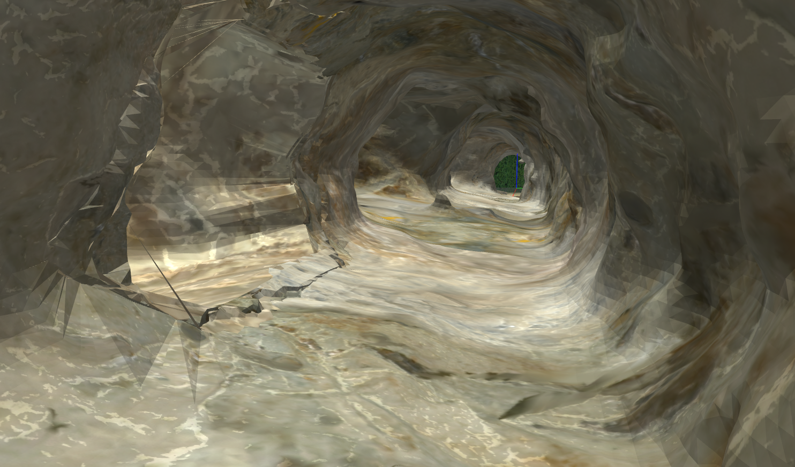
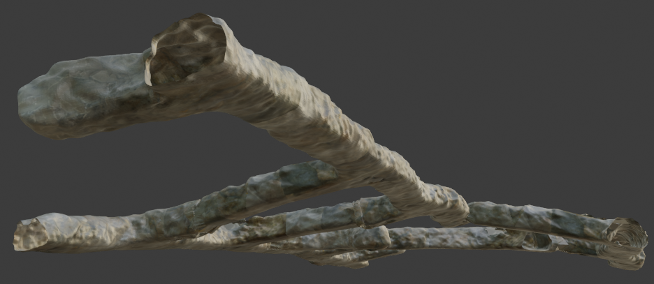
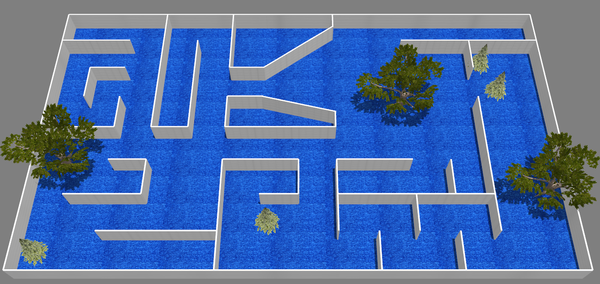
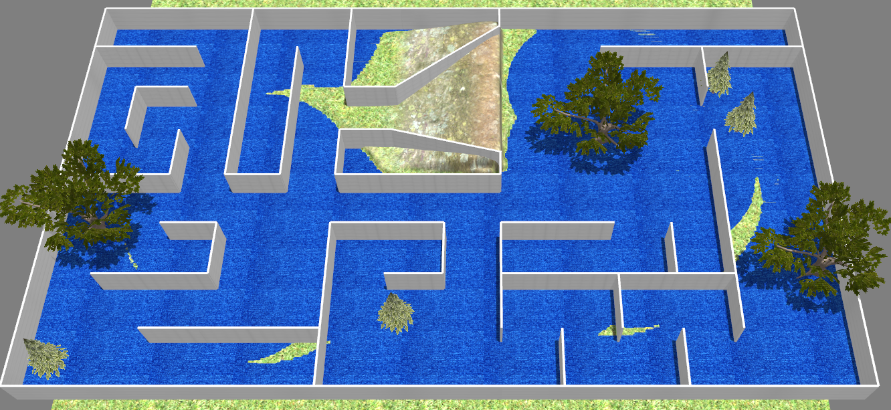
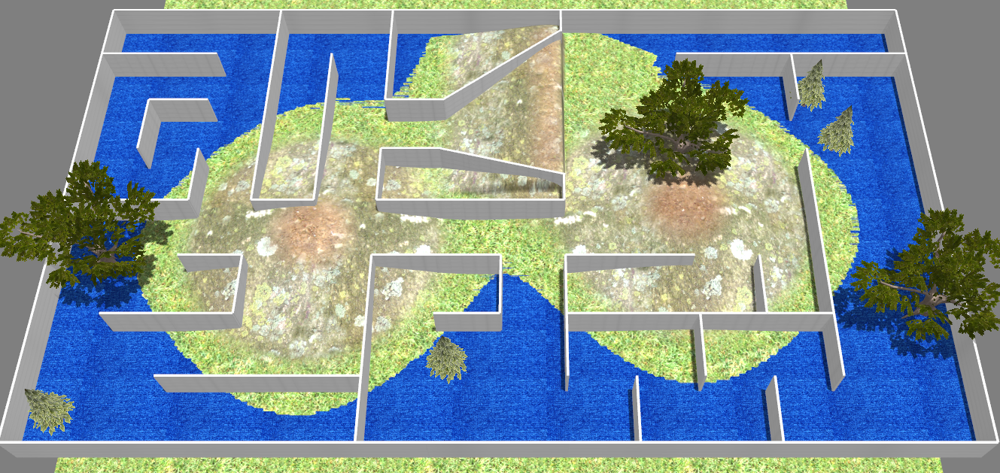
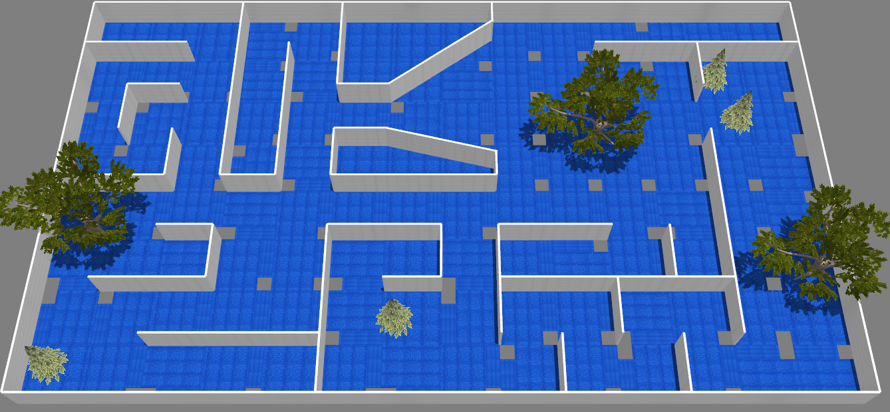
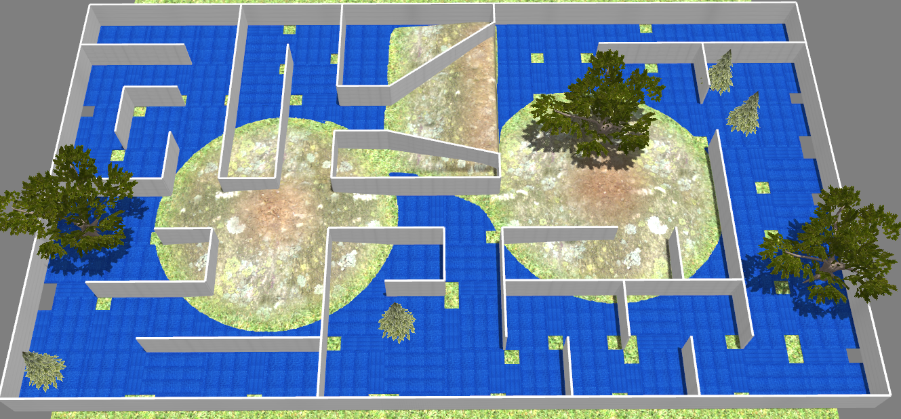
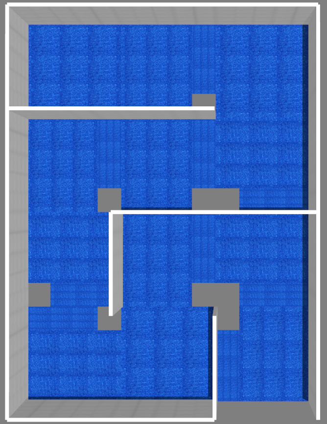

# Gazebo maps
Self-made Gazebo maps for public

 

## List
+ small-scale maze environment
+ large-scale mine environment - edited from [MBPlanner](https://github.com/ntnu-arl/mbplanner_ros/tree/master/planner_gazebo_sim/worlds)
+ maze with height map (hills and cliff) environment
+ maze with hole-ground

 

[click to see pictures]

+ small-scale maze
  

  
  

+ large-scale mine
  

  
  
  

+ maze with height maps
  

  
  
  
  

+ maze with hole-ground
  

  
  
  
  

+ tall wall-bounded world

  

## How to use
+ Clone the git, add the folder in `GAZEBO_MODEL_PATH`
+ Add `common models` to environment first
~~~shell
$ git clone https://github.com/engcang/gazebo_maps
$ echo "export GAZEBO_MODEL_PATH=$GAZEBO_MODEL_PATH:$(pwd)/gazebo_maps/common_models" >> ~/.bashrc
~~~

+ (Optional) add the wanted world to environment
~~~shell
$ echo "export GAZEBO_MODEL_PATH=$GAZEBO_MODEL_PATH:$(pwd)/gazebo_maps/height_maze" >> ~/.bashrc

$ echo "export GAZEBO_MODEL_PATH=$GAZEBO_MODEL_PATH:$(pwd)/gazebo_maps/small_maze" >> ~/.bashrc

$ echo "export GAZEBO_MODEL_PATH=$GAZEBO_MODEL_PATH:$(pwd)/gazebo_maps/large_mine_abandoned" >> ~/.bashrc
To use large_mine_abondoned world, unzip "plz.zip" in the directory.

$ source ~/.bashrc
~~~

+ launch the `world`
~~~shell
$ roslaunch gazebo_ros empty_world.launch world_name:=$(pwd)/gazebo_maps/height_maze/quad.world

or quad_hill_high.world, quad_hole_ground.world, quad_hole_ground_hill_low.world, etc... 
in same directory

or

$ roslaunch gazebo_ros empty_world.launch world_name:=$(pwd)/gazebo_maps/small_maze/smaze2d.world

or

$ roslaunch gazebo_ros empty_world.launch world_name:=$(pwd)/gazebo_maps/large_mine_abandoned/lcmine.world
To use large_mine_abondoned world, unzip "plz.zip" in the directory.
~~~
