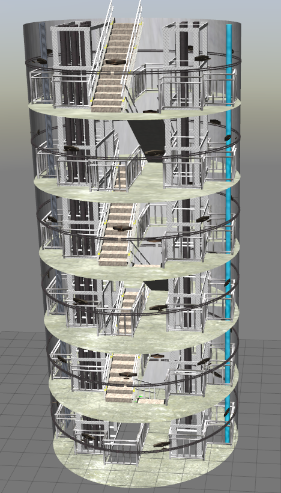
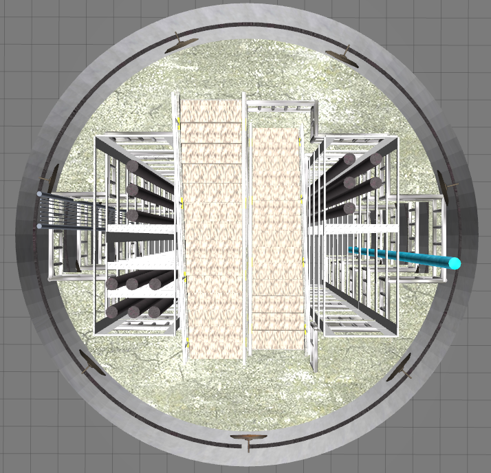
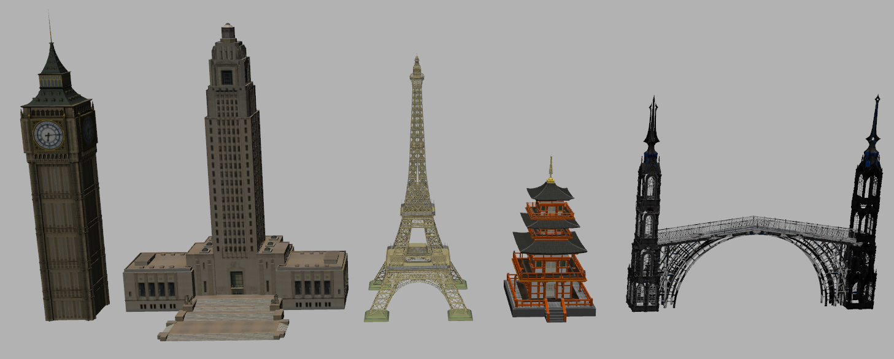
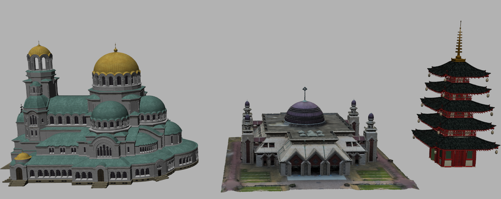
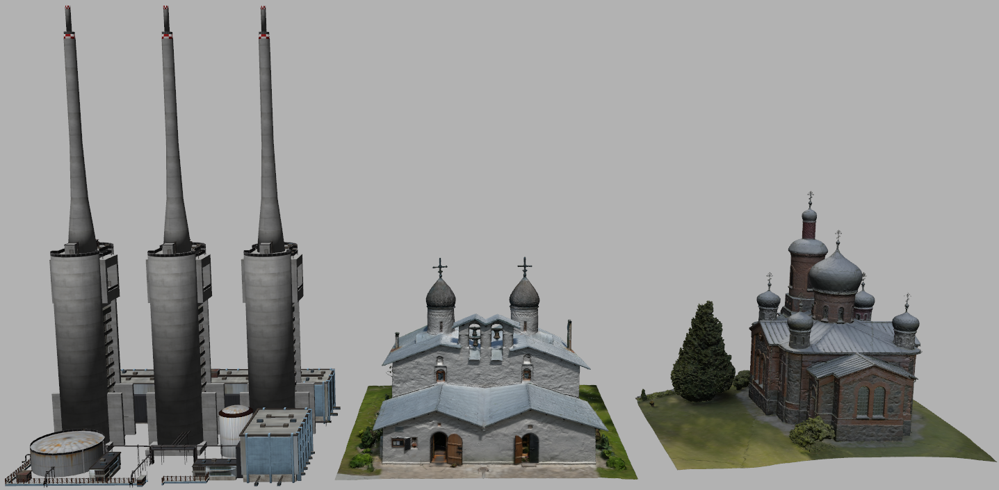
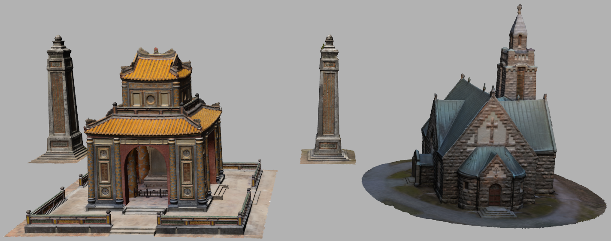
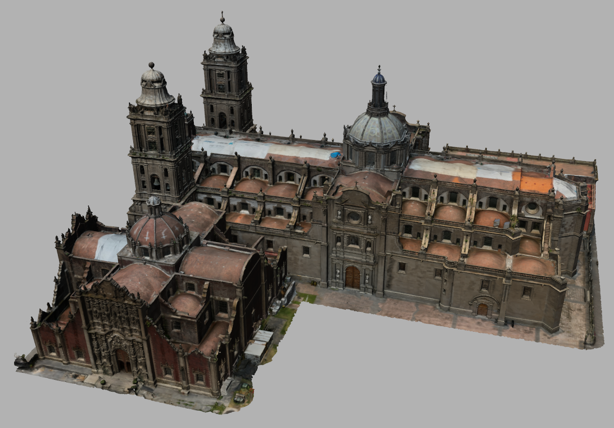

# Gazebo maps
Self-made Gazebo maps and models for public

#### If you use this repo for your paper, please cite the corresponding papers in the list below

<br>

## Map list
+ Exploration map used in the paper:
  + [REAL: Rapid Exploration with Active Loop-Closing toward Large-Scale 3D Mapping using UAVs](https://ieeexplore.ieee.org/abstract/document/9636611), *2021 IROS*
    + Small-scale maze environment
    + Large-scale mine environment - edited from [MBPlanner](https://github.com/ntnu-arl/mbplanner_ros/tree/master/planner_gazebo_sim/worlds)
      + [Video](https://youtu.be/Ux6ir2_ayoY)
  + [QR-SCAN: Traversable Region Scan for Quadruped Robot Exploration using Lightweight Precomputed Trajectory](https://ieeexplore.ieee.org/abstract/document/9650025), *2021 ICCAS*
    + Maze with height map (hills and cliff) environment
    + Maze with hole-ground
      + [Video](https://youtu.be/bz7Ig6GnC-s)
  + [Peacock exploration: a lightweight exploration for UAV using control-efficient trajectory](https://link.springer.com/chapter/10.1007/978-981-16-4803-8_16), *2020 RiTA*
    + Maze with 3D obstacles
      + [Video](https://youtu.be/t3ysB8Y_GCU)
  + (Pending) LiDAR-camera Exploration and Inspection Path Planning, *2023 RA-L*
    + Vertical tunnel
      + [Video](https://youtu.be/emiSJMcA8yM?t=531), [Video2](https://youtu.be/2nyaDcgCnaw)
+ Map used in the paper:
  + [ROLAND: Robust Landing of UAV on Moving Platform using Object Detection and UWB based Extended Kalman Filter](https://ieeexplore.ieee.org/abstract/document/9649920), *2021 ICCAS*
    + Wall bounded world (with obstacles)
      + [Video](https://youtu.be/lgHbKAFs7ao)
+ Textureless and featureless map for visual-inertial odometry used in the paper:
  + [STEP: State Estimator for Legged Robots Using a Preintegrated Foot Velocity Factor](https://ieeexplore.ieee.org/abstract/document/9712415), *2022 IEEE RA-L*
    + Iced outdoor mountain
      + [Video](https://youtu.be/NvkI6I0nX4c)
+ War site scenario map used in the paper:
  + [Development of a 3D Mapping System including Object Position for UAV with a RGB-D camerain an Unknown and GNSS-denied Environment](https://koasas.kaist.ac.kr/handle/10203/277738), *2020 IEMEK*
    + Military fortress (with soldiers, tanks, jets, and etc)
      + [Video1](https://youtu.be/5t-6g7UWA7o) and [Video2](https://youtu.be/0L2FCupYuH8)
+ Quadruped robot [competition map](https://github.com/engcang/gazebo_map_for_khnp)
  + [video](https://youtu.be/6oXx2bvzU9Y), [competition github](https://github.com/Woojin-Seol/KVRC2021)

<br>

## Map pictures

<details><summary>[Click to see pictures]</summary>

+ Small-scale maze

  <p align="center">
  
  </p>

+ Large-scale mine

  <p align="center">
  
  
  </p>

+ Maze with height maps

  <p align="center">
  
  
  
  </p>

+ Maze with hole-ground

  <p align="center">
  
  
  
  </p>

+ Maze with 3D obstacles

  <p align="center">
  
  </p>

+ Vertical tunnel

  <p align="center">
  
  
  </p>

+ Tall wall-bounded world

  <p align="center">
  
  
  </p>

+ Iced outdoor mountain
  <p align="center">
  
  
  </p>

+ Military fortress
  <p align="center">
  
  </p>

</details>


<br>

## Model list (in `reconstruction` folder)

+ Reconstruction models used in the paper:
  + [CEO-MLCPP: Control-Efficient and Obstacle-aware Multi-Layer Coverage Path Planner for 3D reconstruction with UAVs](https://github.com/engcang/CEO-MLCPP), *2022 RiTA*
    + [`Big-Ben`](https://skfb.ly/6CY66), [`Eiffel Tower`](https://skfb.ly/AIU9), [`Japanese temple`](https://skfb.ly/6Twyt)
  + Two-Stage Optimization-Based Energy-Efficient Coverage Path Planner for 3D reconstruction, *2023 KRoC*
    + [`Japanese temple2`](https://skfb.ly/6RyU9)
  + THE-Planner: Topological and Hierarchical Exploration Path Planner for Fast and Coarse 3D Mapping of Outdoor Structures with UAVs, *2023 UR*
    + [`San Adrian thermal powerplant`](https://skfb.ly/otxH6), [`Orthodox church`](https://skfb.ly/o7uZD)
  + [EQA-CPP: Energy and Quality-Aware Coverage Path Planner for 3D reconstruction with UAVs](https://github.com/engcang/EQA-CPP), *2023 RA-L (pending)*
    + [`Alexander Nevsky Cathedral`](https://skfb.ly/otCOL), [`At Tin Mosque`](https://skfb.ly/6TGTC)
    + [`Louisiana State House`](https://skfb.ly/oxwWF), [`Khram Pokrova`](https://skfb.ly/o7nBM)
    + [`Tomb of Tu Duc`](https://skfb.ly/6SRAz), [`Stone church`](https://skfb.ly/6RFIs)
    + [`Mexico City Cathedral`](https://skfb.ly/6RvxJ)

+ Models not used in any paper:
    + [`Louisiana State House`](https://skfb.ly/oxwWF), [`Bridge`](https://skfb.ly/6WZuC)

<br>

## Model Pictures

<details><summary>[Click to see pictures]</summary>

+ Models in `recon1.tar.xz` file (`Big-Ben`, `Louisiana State House`, `Eiffel Tower`, `Japanese temple`, `Bridge`)

  <p align="center">
  
  </p>

+ Models in `recon2.tar.xz` file (`Alexander Nevsky Cathedral`, `At Tin Mosque`, `Japanese temple2`)

  <p align="center">
  
  </p>

+ Models in `recon3.tar.xz` file (`San Adrian thermal powerplant`, `Khram Pokrova`, `Orthodox church`)

  <p align="center">
  
  </p>

+ Models in `recon4.tar.xz` file (`Tomb of Tu Duc`, `Stone church`)

  <p align="center">
  
  </p>

+ Models in `recon5.tar.xz` file (`Mexico City Cathedral`)

  <p align="center">
  
  </p>
</details>

<br><br>

## How to use
### unzip the compressed files
```shell
$ tar -xf name.tar.xz
```
+ Clone the git, add the folder in `GAZEBO_MODEL_PATH`
+ **(Necessary)** Add `common models` to environment first
~~~shell
$ git clone https://github.com/engcang/gazebo_maps
$ echo "export GAZEBO_MODEL_PATH=$GAZEBO_MODEL_PATH:$(pwd)/gazebo_maps/common_models" >> ~/.bashrc
~~~

+ (Optional) add the wanted world to environment
~~~shell
$ echo "export GAZEBO_MODEL_PATH=$GAZEBO_MODEL_PATH:$(pwd)/gazebo_maps/height_maze" >> ~/.bashrc

$ echo "export GAZEBO_MODEL_PATH=$GAZEBO_MODEL_PATH:$(pwd)/gazebo_maps/3d_maze" >> ~/.bashrc

$ echo "export GAZEBO_MODEL_PATH=$GAZEBO_MODEL_PATH:$(pwd)/gazebo_maps/large_mine_abandoned" >> ~/.bashrc

...

Add the world/model path you want!!

$ source ~/.bashrc
~~~

+ launch the `world`
~~~shell
$ roslaunch gazebo_ros empty_world.launch world_name:=$(pwd)/gazebo_maps/small_maze/smaze2d.world

or

$ roslaunch gazebo_ros empty_world.launch world_name:=$(pwd)/gazebo_maps/3d_maze/eazy_maze.world

or

...

Launch the world/model you want!
~~~
